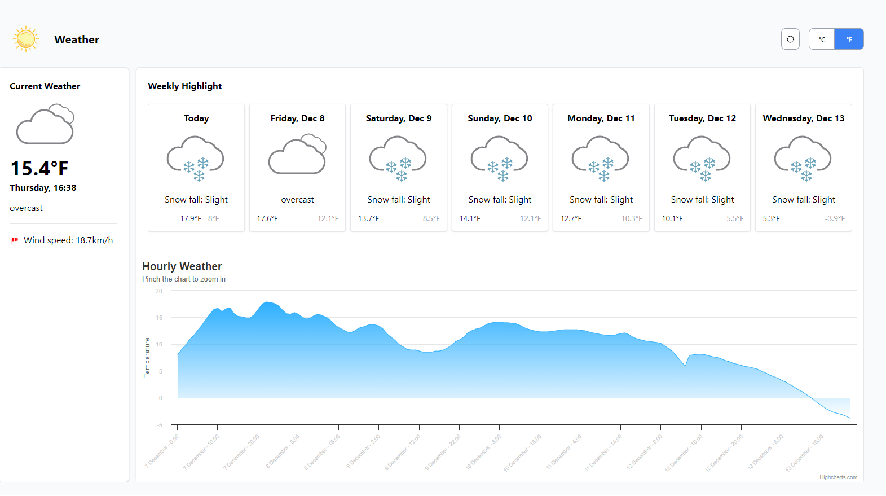

### Weather

### Description
This application is programmed with JavaScript. weather data is getting from the 'https://api.open-meteo.com/v1/forecast' API and will show like the picture below:

.

The default temperature unit is Celcius. You can see temperatures in Farenhite by pressing the F button (at the top-right of the page).

By clicking on the Refresh symbol, data will get again and output will update.

This page is responsive and can be shown correctly in every screen size.

#### Library used
- Tailwindcss version 3.3.5
- Highcharts version v11.2.0

### Scripts functions

- fetchWeatherData
    - This function, is the main task on the page. It would be called when the page is loaded or when user refresh or ask for another unit of temperature.
    - Parameters
        - temp : temperature unit. It can be `c` or `f`. Invalid input is considered as `c` .
        
- httpGetAsync
    - This function gets the URL and its parameters, then returns its response.
    - Parameters
            - theUrl : a url (string) that needs to be fetched
            - params : all parameters for URL as an object
            - callback : function that should be executed as a callback for GET
- formatParams
    - This function gets an object of parameters and converts it to a string and valid format for URL.
    - Parameters
        - params : an object of all parameters of url. keys are names and values are value of parameters. 
            - example
                ```
                  {
                      "latitude": "65.01",
                      "longitude": "25.47",
                      "current": "temperature_2m,weather_code,wind_speed_10m",
                      "hourly": "temperature_2m",
                      "daily": "weather_code,temperature_2m_max,temperature_2m_min",
                      "models": "best_match"
                  }
                ```
- createDailyWeatherHTML
    - This function gets the daily part of the GET response and creates HTML based on it.
    - Parametes
        - weatherData : object contains daily forecast.
          - example
            ```javascript
                   {
                    "forecast": {
                        "0": {
                            "time": "2023-12-07",
                            "weather_code": 71,
                            "weather_code_des": "Snow fall: Slight",
                            "min_temp": -13.4,
                            "max_temp": -8.5
                        },
                        "1": {
                            "time": "2023-12-08",
                            "weather_code": 3,
                            "weather_code_des": "overcast",
                            "min_temp": -11.4,
                            "max_temp": -8.8
                        },
                        "2": {
                            "time": "2023-12-09",
                            "weather_code": 3,
                            "weather_code_des": "overcast",
                            "min_temp": -14.4,
                            "max_temp": -10.4
                        },
                        "3": {
                            "time": "2023-12-10",
                            "weather_code": 71,
                            "weather_code_des": "Snow fall: Slight",
                            "min_temp": -13.9,
                            "max_temp": -10.6
                        },
                        "4": {
                            "time": "2023-12-11",
                            "weather_code": 71,
                            "weather_code_des": "Snow fall: Slight",
                            "min_temp": -16.9,
                            "max_temp": -14.1
                        },
                        "5": {
                            "time": "2023-12-12",
                            "weather_code": 71,
                            "weather_code_des": "Snow fall: Slight",
                            "min_temp": -19.7,
                            "max_temp": -13.5
                        },
                        "6": {
                            "time": "2023-12-13",
                            "weather_code": 71,
                            "weather_code_des": "Snow fall: Slight",
                            "min_temp": -19.9,
                            "max_temp": -14.8
                        }
                    },
                    "unit": {
                        "max_unit": "°C",
                        "min_unit": "°C"
                    }
                }
            ```
- createCurrentWeatherHTML
    - This function gets the current part of the GET response and creates HTML based on it.
    - Parameters
        - weatherData : object contains current weather.
            - example
            ```javascript
                {
                    "time": "2023-12-07T16:30",
                    "weather_code": 3,
                    "weather_code_des": "overcast",
                    "wind_speed": 19.4,
                    "wind_speed_unit": "km/h",
                    "temperature_2m": -10.4,
                    "temp_unit": "°C"
                }
            ```
         
- createChart
    - This function gets the hourly part of the GET response and creates a chart (using Highcharts) based on it.
    - Parameters
        - weatherData : an object/array of hourly forecast data
            - example
                ```javascript
                [
                    [
                        "7 December - 0:00",
                        -13.4
                    ],
                    [
                        "7 December - 9:00",
                        -8.6
                    ],
                    [
                        "7 December - 10:00",
                        -8.5
                    ],
                    [
                        "7 December - 11:00",
                        -8.8
                    ],
                    [
                        "7 December - 12:00",
                        -8.6
                    ],
                    [
                        "7 December - 13:00",
                        -8.5
                    ],
                    [
                        "7 December - 14:00",
                        -9.1
                    ],
                    [
                        "7 December - 15:00",
                        -10
                    ],
                    [
                        "7 December - 16:00",
                        -10.4
                    ],
                    [
                        "7 December - 17:00",
                        -10.4
                    ],
                    [
                        "7 December - 18:00",
                        -10.4
                    ],
                    [
                        "7 December - 19:00",
                        -10.2
                    ],
                    [
                        "7 December - 20:00",
                        -9.6
                    ],
                    [
                        "7 December - 21:00",
                        -9.1
                    ],
                    [
                        "7 December - 22:00",
                        -8.7
                    ],
                    [
                        "7 December - 23:00",
                        -8.6
                    ],
                    [
                        "8 December - 0:00",
                        -8.8
                    ],
                    [
                        "8 December - 1:00",
                        -8.9
                    ],
                    [
                        "8 December - 2:00",
                        -9.3
                    ],
                    [
                        "8 December - 3:00",
                        -9.6
                    ],
                    [
                        "8 December - 4:00",
                        -9.7
                    ],
                    [
                        "8 December - 5:00",
                        -9.6
                    ],
                    [
                        "8 December - 6:00",
                        -9.7
                    ],
                    [
                        "8 December - 7:00",
                        -10
                    ],
                    [
                        "8 December - 8:00",
                        -10.2
                    ],
                    [
                        "8 December - 9:00",
                        -10.1
                    ],
                    [
                        "8 December - 10:00",
                        -9.7
                    ],
                    [
                        "8 December - 11:00",
                        -9.4
                    ],
                    [
                        "8 December - 12:00",
                        -9.4
                    ],
                    [
                        "8 December - 13:00",
                        -9.5
                    ],
                    [
                        "13 December - 23:00",
                        -14.9
                    ]
                ]
                ```
    
### How to run
Just open index.html in a web browser. 

### potential plans
- Choose an area to get its weather forecast
- Show hourly temperature and weather conditions for the next seven days with a click on the day
- The ability to change the default temperature unit for the user
- Keep the current tempreture unit when the user refresh the page content
- Implement the app using React.js
