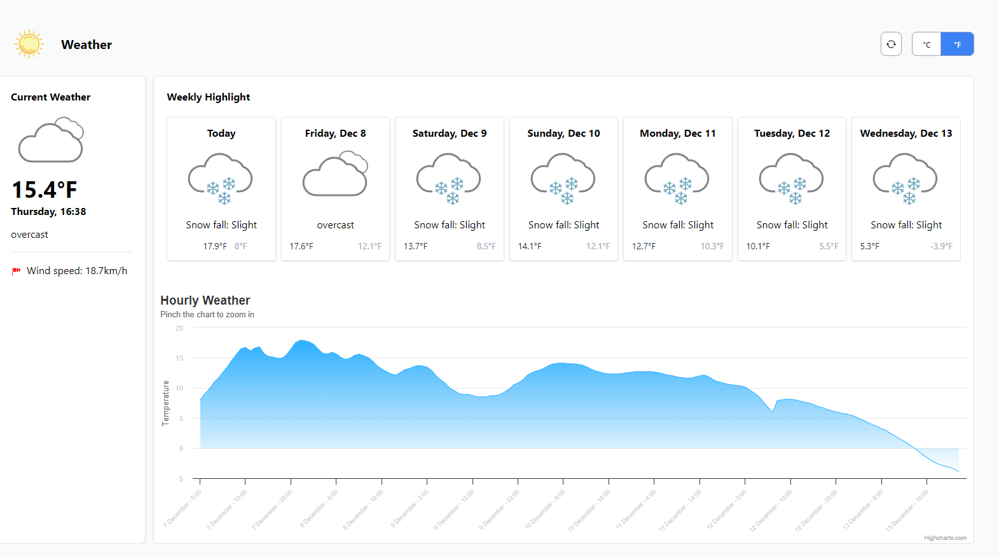

### Weather

### Description
This application is programmed with JavaScript. weather data is getting from the 'https://api.open-meteo.com/v1/forecast' API and will show like the picture below:

.

The default temperature unit is C. You can see temperatures in Farenhite by pressing the F button (at the top-right of the page).

By clicking on the Refresh symbol, data will get again and output will update.

This page is responsive and can be shown correctly in every screen size.

#### Library used
- Tailwindcss version 3.3.5
- Highcharts version v11.2.0

### Scripts functions

- fetchWeatherData
    - This function, is the main task on the page. it calls when the page is loaded or when we refresh or ask for another unit of temperature. 
- httpGetAsync
    - This function gets the URL and its parameters, then returns its response.
- formatParams
    - This function gets an object of parameters and converts it to a string and valid format for URL.
- createDailyWeatherHTML
    - This function gets the daily part of the GET response and creates HTML based on it.
- createCurrentWeatherHTML
    - This function gets the current part of the GET response and creates HTML based on it.
- createChart
    - This function gets the hourly part of the GET response and creates a chart (using Highcharts) based on it.
    
### How to run
Just open index.html in a web browser. 

### potential plans
- Choose an area to get its weather forecast
- Show hourly temperature and weather conditions for the next seven days with a click on the day
- The ability to change the default temperature unit for the user
- Keep the current tempreture unit when the user refresh the page content
- Implement the app using React.js
